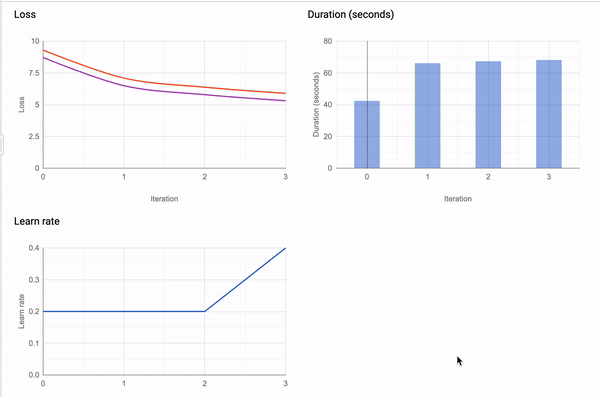

<h1 align="center">Welcome to Hot Tips for Cabbies: Using Big Data to Optimize NYC Taxi Gratuities  👋</h1>
<p>
  <a href="#" target="_blank">
    
  </a>
  <a href="https://twitter.com/lorarjohns" target="_blank">
    
  </a>
</p>

> Using BigQuery's native Machine Learning tools and cloud database, can we discover the latent factors that lead to the greatest tips for working cab drivers in NYC?

## The Goal: Fit a model to predict the gratuities on a fare


## The Data: New York City Yellow Taxi Rides in 2018

```sql

```

## The Model: Machine Learning in BigQuery


## Author

👤 **Lora Johns**

* Twitter: [@lorarjohns](https://twitter.com/lorarjohns)
* Github: [@lorarjohns](https://github.com/lorarjohns)

## Show your support

Give a ⭐️ if this project helped you!

<a href="https://www.patreon.com/lorarjohns">
  
</a>

***
_This README was generated with ❤️ by [readme-md-generator](https://github.com/kefranabg/readme-md-generator)_